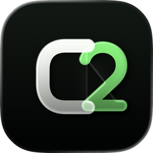
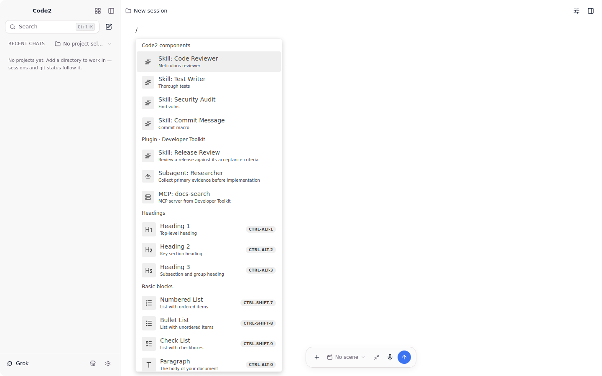

<p align="center">
  
</p>

<h1 align="center">C2</h1>

<p align="center">
  <strong>The document-first coding agent.</strong><br />
  Compose structured prompts, weave in reusable skills, and run your coding CLIs through one local interface.
</p>

<p align="center">
  <a href="https://ichendev.github.io/codeTwo/">Website</a> ·
  <a href="website/guide/getting-started.md">Get started</a> ·
  <a href="docs/README.md">Documentation</a> ·
  <a href="docs/reference/architecture.md">Architecture</a> ·
  <a href="docs/reference/plugin-standard.md">Plugin standard</a> ·
  <a href="docs/reference/plugin-protocol.md">Plugin protocol</a>
</p>



> [!IMPORTANT]
> C2 is pre-release software. The core product works, but there are no signed binary releases
> yet. Build it from source and expect APIs, storage, and packaging details to change before 1.0.

## Why C2

Most coding-agent clients begin with a chat box. C2 begins with a document. You can shape a
long brief with headings and lists, insert skills and files exactly where they belong, inspect the
whole turn, and only then send it to the agent you choose.

- **Document-first prompts.** Compose in a BlockNote editor instead of squeezing a specification
  into a single-line input.
- **Eleven coding CLIs, one protocol.** Drive Claude Code, Codex, Grok, Cursor, OpenCode 1 or 2,
  Pi, Kimi, ZCode/GLM, Amp, and Droid through the
  [Agent Client Protocol](https://agentclientprotocol.com/).
- **Skills and complete plugins.** Insert reusable skills inline, or install GitHub packages that
  can include skills, subagents, MCP servers, and project scaffolds.
- **Local, inspectable continuity.** Sessions and project memory live in the shared Rust core;
  derived memories retain their sources and can be pinned or forgotten.
- **Git-aware execution.** Use per-session worktrees, automatic checkpoints, diffs, revert, and
  explicit commit/push flows.
- **Three surfaces.** C2 ships an Electrobun desktop app, a ratatui TUI, and a paired remote web
  client. All three compose the same Rust Core through the same plugin runtime; Electrobun is the
  desktop shell and relays one command/event protocol to its bundled Rust host.

## How it fits together

```text
Claude Code · Codex · Grok · Cursor · OpenCode 1 · OpenCode 2 · Pi · Kimi · GLM · Amp · Droid
                              │
                         ACP over stdio
                              │
                 Rust product core
                         │
               Plugin composition layer
                    ┌─────────┼─────────┐
                    │         │         │
                Desktop      TUI      Remote
          Electrobun + React  ratatui  Axum + WebSocket
```

C2's internals form a runtime-module graph inspired by
[cordis](https://github.com/cordiverse/cordis): storage, agent execution, git, memory, scenes, and
other subsystems declare what they require and provide. Separately installed extensions use the
small JSON-RPC [plugin protocol](docs/reference/plugin-protocol.md) and only the explicitly exported Extension
API; the internal Rust trait and Core commands are not the public plugin contract. Package,
lifecycle, scope, security, and host behavior follow the
[C2 Plugin Standard](docs/reference/plugin-standard.md).

## Build from source

### Prerequisites

- Rust 1.82 or newer
- Zig **0.15.2** exactly, required by the embedded Ghostty terminal engine
- Bun
- Git
- Your platform's native build tools (Xcode command-line tools on macOS)
- At least one supported provider CLI if you want to run a real agent turn

On macOS, install the pinned Zig version with Homebrew:

```sh
brew install zig@0.15
brew link --force zig@0.15
```

Then clone the repository and run the desktop app:

```sh
git clone https://github.com/IchenDEV/codeTwo.git
cd codeTwo
./script/dev/run.sh
```

C2 detects provider CLIs on your `PATH`. Provider-specific setup and the exact adapter commands
are documented in [Providers](website/guide/providers.md).

### Nightly package

Every push to `main`, plus the daily 02:17 Asia/Singapore schedule, builds and verifies an Apple
Silicon DMG in the [Nightly macOS package](.github/workflows/nightly-macos.yml) workflow. Download
`C2-nightly-macos-arm64-<commit>` from that run's artifacts. Nightly packages are ad-hoc signed but
not Apple-notarized, so they are for testing rather than general distribution.

Development, nightly, and release builds can be installed together. Their macOS identities and
default data directories are isolated:

| Channel | Application | Bundle identifier | Application Support directory |
| --- | --- | --- | --- |
| Development | `C2-dev.app` | `dev.codetwo.app.dev` | `dev.codetwo.app.dev` |
| Nightly | `C2 Nightly.app` | `dev.codetwo.app.nightly` | `dev.codetwo.app.nightly` |
| Release | `C2.app` | `dev.codetwo.app` | `dev.codetwo.app` |

Only release builds embed the Sparkle update helper. Development and nightly builds stay on their
explicit build channel and cannot replace a release through the in-app updater.

### Versioned release

Run the [Release macOS](.github/workflows/release-macos.yml) workflow, enter a semantic version such
as `0.1.0`, provide a canonical change id whose Artifact is `ready-to-release`, and choose whether
it is a prerelease. The workflow builds and verifies the versioned Apple Silicon DMG before it
creates the matching `v<version>` tag and publishes a GitHub Release with the DMG, SHA-256 checksum,
and authorized change id. Existing tags are never overwritten.

Release packages are currently ad-hoc signed and not Apple-notarized. They are suitable for testing
through GitHub Releases, but a public production distribution still requires Developer ID signing
and notarization.

### Other surfaces

From the repository root:

```sh
# Build the TUI, server, and their sibling Bun Tool Broker
./script/build/hosts.sh release

# Terminal interface
./target/release/codetwo-tui

# Paired remote web client
./target/release/codetwo-server

# Self-contained turn demo using a stub ACP agent (requires Node)
cargo run -p codetwo-core --example live_demo
```

The remote server prints a one-time pairing URL and token. Keep it on a trusted LAN or Tailscale
tailnet; C2 does not provide a hosted relay.

## Repository map

| Path                             | Purpose                                                                     |
| -------------------------------- | --------------------------------------------------------------------------- |
| [`crates/kernel`](crates/kernel) | Reactive plugin runtime and command registry                                |
| [`crates/core`](crates/core)     | Plugin-independent product domain: ACP, sessions, providers, policy, and persistence |
| [`crates/plugins`](crates/plugins) | Core adapters, built-in runtime graph, extension bundles, protocol, and marketplace |
| [`crates/tui`](crates/tui)       | ratatui frontend                                                            |
| [`crates/server`](crates/server) | Headless server, pairing, WebSocket protocol, and remote client             |
| [`apps/desktop`](apps/desktop)   | Electrobun + React + BlockNote desktop app                                  |
| [`packages/tool-broker`](packages/tool-broker) | Provider-neutral special-tool catalog and immutable routing plans |
| [`website`](website)             | VitePress documentation and GitHub Pages site                               |
| [`docs`](docs/README.md)         | Documentation map, current contracts, designs, research, and SDLC records   |
| [`script`](script/README.md)     | Development, build, and repository-verification entry points                |

## Development

Run Rust checks from the repository root:

```sh
cargo check --workspace --all-targets
cargo test --workspace
./script/build/hosts.sh debug
```

Run desktop checks from `apps/desktop`:

```sh
bun install --frozen-lockfile
bun run lint
bun test
bun run build
```

Build the documentation site from `website`:

```sh
bun install --frozen-lockfile
bun run docs:build
```

The desktop UI follows the repository's [design system](docs/design/system.md). Product surfaces use the
shared components under `apps/desktop/src/components/ui`; avoid introducing one-off interaction
primitives or visual tokens.

## Contributing

Bug reports, documentation fixes, and focused pull requests are welcome. For a large change, open
an issue first so the product boundary and protocol impact can be discussed before implementation.

Please keep changes scoped, add tests for behavior changes, and run the relevant checks above. A
pull request that changes user-visible desktop UI should include light, dark, and narrow viewport
evidence where applicable.

Material changes follow the repository's [AI-native development lifecycle](docs/sdlc/workflow.md).
Link the canonical change Artifact in the pull request. Implementation starts only after its
Intent/Spec is accepted and the Artifact reaches `executing`; do not create a parallel lifecycle,
specs, or plans registry.

## Security and privacy

C2 runs provider CLIs as local child processes and communicates with them over stdio. C2
does not change the provider's own network, authentication, data-retention, or tool policies;
review those separately before giving a provider access to sensitive code.

Remote access is bearer-token based and intended for a trusted LAN or Tailscale network. Do not
expose `codetwo-server` directly to the public internet. Please report a suspected vulnerability
privately to the repository owner rather than opening a public exploit report.

## License

Licensed under the [Apache License 2.0](LICENSE).
