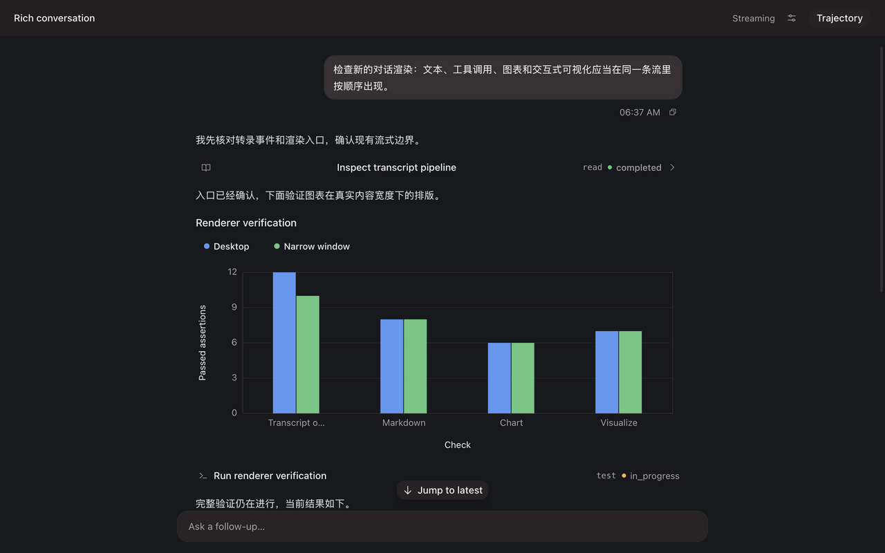
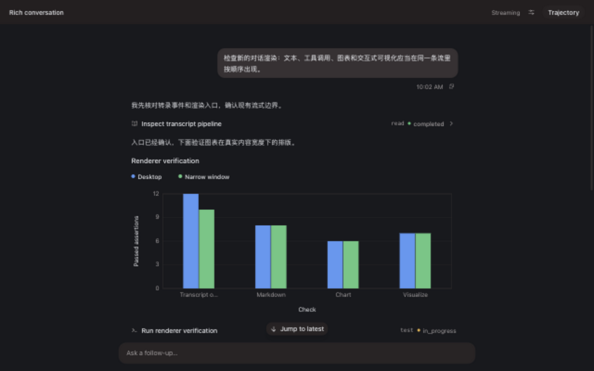
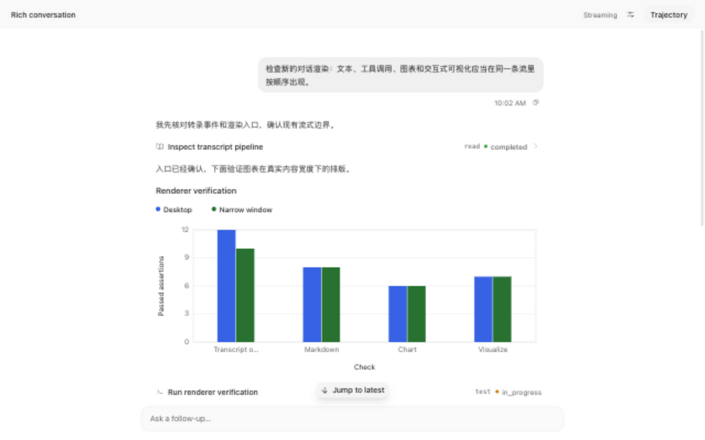
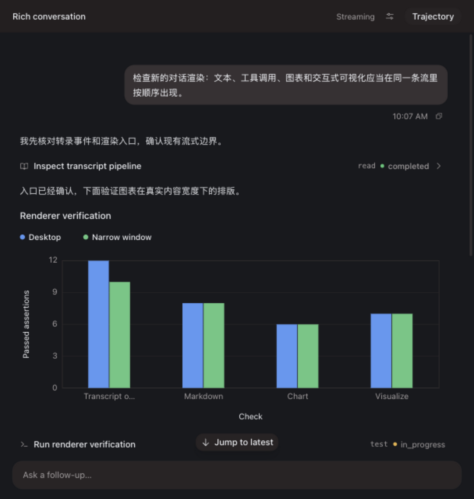

# Verification: Align the transcript tool card title

## Verification

- AC-1: PASS — `bun test tests/turnCardRendered.test.tsx` passes 16 tests, including
  `leads tool-card titles from the shared icon edge`, which asserts `justify-start` + `text-start`
  on the group trigger and `text-start` on the compact history-row trigger while the title span keeps
  `min-w-0 flex-1 truncate`. In the pre-change rendered page the title span computed
  `text-align: center` with the text at x=487 inside the 283–987 row; after the change the title
  reads from x=305 directly after the icon.
  
  
- AC-2: PASS — the same test asserts `has-[>svg]:ps-0` on both triggers, and the new
  `keeps a standalone tool row on the shared content column` case asserts `pe-1` and no `px-1` on the
  no-output row (`bun test tests/turnCardRendered.test.tsx`). Browser geometry via
  `bunx vite --mode web` on the dev preview (`http://localhost:1499/?rich-transcript`) measured the
  markdown paragraph, the `Inspect transcript pipeline` icon and the standalone row's leading icon all
  at x=283 (previously the trigger icon at x=291 and the no-output row at x=287, the 8px and 4px row
  insets); the trailing `read ● completed ›` metadata stayed at its own end-of-row position.
- AC-3: PASS — the new `keeps the chart legend on the shared content column` case renders a
  two-series chart and asserts the legend container carries `-ms-surface-inset`
  (`bun test tests/turnCardRendered.test.tsx`). The same browser measurement put the legend dots at
  x=283 with the legend container compensated to x=271, previously 295 inside a flush container.
- AC-4: PASS — in-page geometry measured `textLeft/triggerIconLeft/plainIconLeft/legendDotLeft` at
  x=283/283/283/283 in dark and light at 1280px, and x=32/32/32/32 at a 760px viewport with
  `document.documentElement.scrollWidth <= innerWidth` (no horizontal overflow). Screenshots:
  
  
  
- AC-5: PASS — `bun run lint`, `bunx tsc --noEmit`, and `bun test` pass in `apps/desktop` (917
  passed, 3 skipped, 0 failed across 164 files); the group-disclosure case still expands the compact
  history and the tool-card cases assert the trailing kind/status/chevron markup is untouched.

Verdict: verified.
Residual risk: the group trigger and the compact history rows were verified through the rendered
class contract plus the browser measurement of the identical `ToolCallBlock` trigger class list; the
dev preview specimen has no grouped run, so those two rows were not separately pixel-captured. The
DOM test harness has no layout engine, so alignment is proven in the browser rather than in
`bun test`. Only the transcript tool rows and the chart legend row changed; other row-like buttons
that may inherit the same native-button centering remain out of scope.

## Cleanup

Removed: `.codex/run/instances/align-tool-card/` (the Vite profile root this task created, including
`vite.log` and `vite-cache/`) was deleted after its server stopped.
Retained: this record's `evidence/` PNGs (`tool-card-before-centered.png`,
`tool-card-after-leading-dark.png`, `tool-card-column-aligned-dark.png`,
`tool-card-column-aligned-light.png`, `tool-card-column-aligned-narrow.png`) as the rendered layout
evidence cited above; the thread's collaborative preview tab now points at the stopped dev-server
URL, so the user may close it.
Retention owner: chenli, the change owner.
Cleanup trigger: delete this record's `evidence/` directory when the record is superseded or the
change is merged and no longer under review.
Processes: the task-owned Vite dev server was stopped (last pid 1558 for the first run, then the
second run's process) and TCP 1499 re-checked as released; no Core instance was started, so the
user's running desktop data directory was untouched.
Evidence: `pgrep -fl "t3code-96c15fc8/apps/desktop/node_modules/.bin/vite"` reported nothing after
the stop, `lsof -nP -iTCP:1499 -sTCP:LISTEN` was empty, and `find .codex/run -maxdepth 3 -type d`
shows only the empty `run/instances` parents.

## Review and release

Approval: implementation was requested directly by the user on 2026-09-15/16, first as
修复对齐排版问题 and then as 这个对齐上需要加点补偿; merge, release, and external actions are not
authorized.
Rollback: revert the class additions and the three regression cases; no data, protocol, or
persistence surface is involved.
Release: No release requested; merge and external actions require their own authorization.
Feedback: Link an Incident and regression Eval when a real failure occurs.
