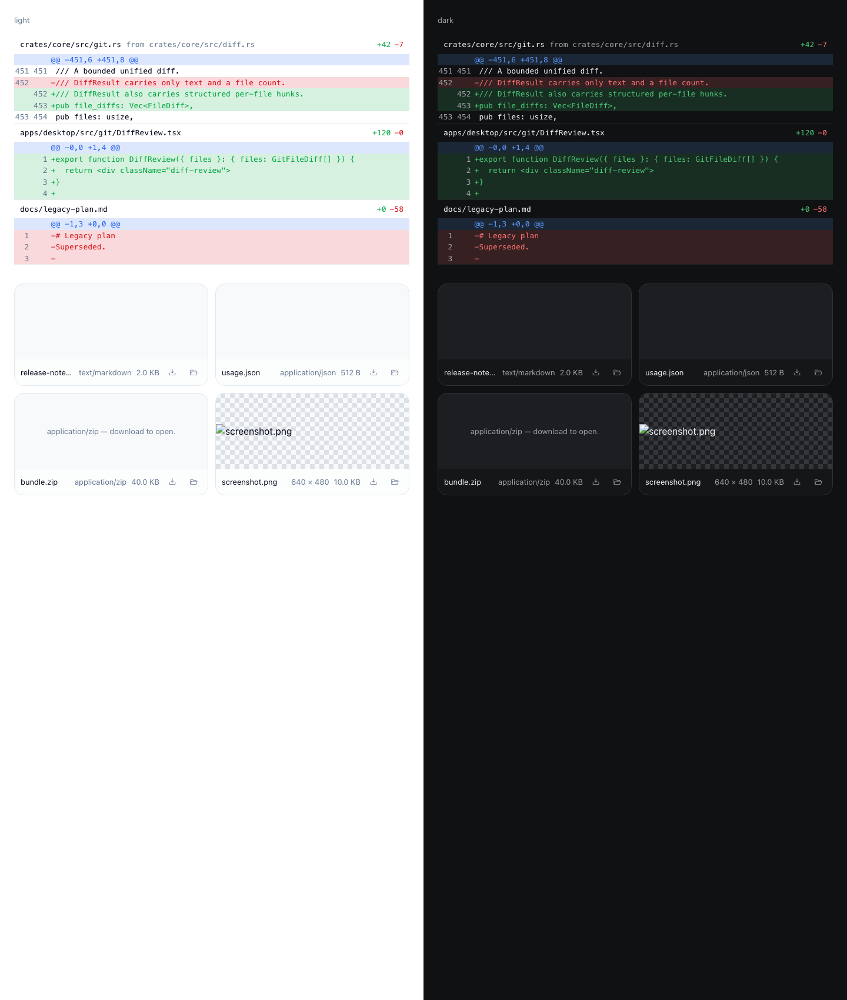
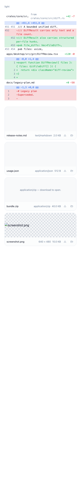

# Verification: Structured per-file diff review

Accepted at the local/automated level on the requester's explicit instruction ("在本级验收"). The
structured diff is proven against a real worktree change, and the review surface is rendered in a
real browser in light, dark, and narrow states.

## Verification

- AC-1: PASS — `cargo test -p codetwo-core --lib git::tests` runs
  `parses_per_file_hunks_with_line_numbers_and_counts` (two `diff --git` sections, `src/a.rs` 2/1
  and `b.txt` 1/0) and `diff_scopes_and_stat_are_distinct`, which asserts `all.file_diffs` for a real
  git worktree change: one file `both.txt`, counts 1/1, one hunk, and the added line carrying only a
  new-side number.
- AC-2: PASS — the same run asserts `@@ -1,3 +1,4 @@` ranges with per-kind line numbers, and
  `parses_renames_and_tolerates_empty_or_truncated_text` asserts the omitted-count form
  `@@ -7 +9 @@` as `(7,1)`/`(9,1)` with `old_line = 7`, `new_line = 9`.
- AC-3: PASS — the same tests parse `rename from old.rs` / `rename to new.rs` into
  `path = "new.rs"`, `old_path = Some("old.rs")`, and resolve a new file from `+++` while ignoring
  the `/dev/null` pre-image.
- AC-4: PASS — `parse_unified_diff("")` is empty and a truncated tail yields exactly one file with
  its single hunk and 1/1 counts, without panicking.
- AC-5: PASS — `bun test tests/diffReviewRendered.test.tsx` renders the component and asserts two
  collapsible sections, the path, `from src/old_a.rs`, `+2`/`-1`, per-kind classes, and old/new
  gutter values; a real Chromium render of the same component in light and dark at 1440px and narrow
  at 430px confirms file headers, `+N −M` statistics, hunk headers, line-number gutters, rename
  hints, and no horizontal overflow:
  
  

Verdict: verified.
Residual risk: the structured view is capped by the same core byte/file bounds, so a diff truncated
before a complete `diff --git` section falls back to the flat preview; very large diffs still render
every parsed line with no virtualization; the browser render used representative data rather than
the live desktop window.

## Cleanup

Removed: the temporary verification harness (`apps/desktop/verify-ui.html`, `verify-ui.tsx`,
`vite.verify.config.ts`) and its `/tmp/verify-ui-dist` output, plus the transient HTTP server used
for the headless render; no listener remains on ports 1430/1431.
Retained: the two evidence PNGs under this record's `evidence/` directory.
Retention owner: this change record.
Cleanup trigger: remove with the change record if it is ever pruned.
Processes: none; the headless render and its server exited within one command.
Evidence: `git status --porcelain` and `lsof -nP -iTCP:1430 -iTCP:1431` (empty).

## Review and release

Approval: pending — merge and external actions require their own authorization.
Rollback: See plan.md.
Release: No release requested; merge and external actions require their own authorization.
Feedback: Link an Incident and regression Eval when a real failure occurs.
