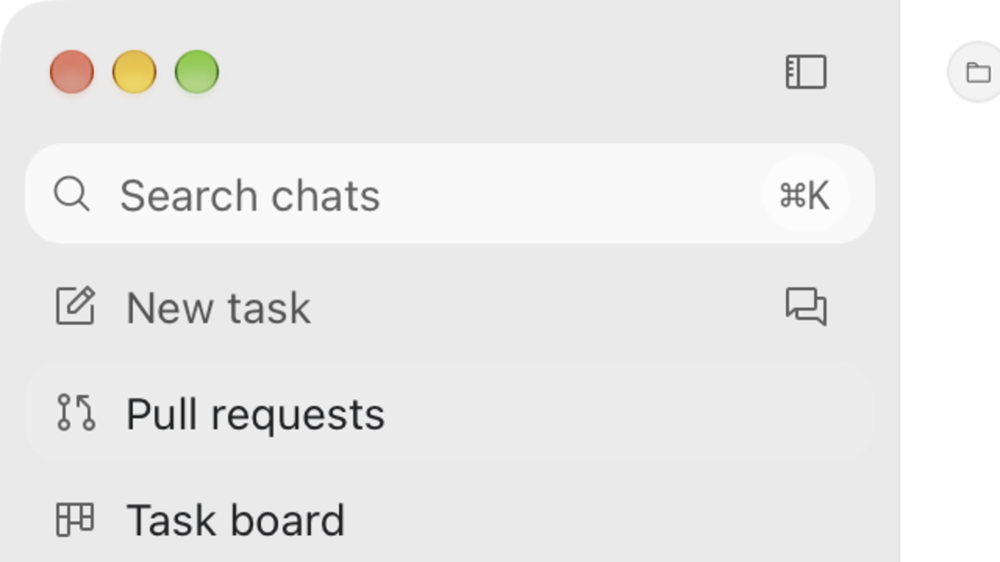

# Verification: Align the macOS traffic lights with the rail's leading column

## Verification

- AC-1: PASS — `bun test tests/windowChromeContract.test.ts` passes 15 tests: the `dom-ready`
  darwin branch and the `resize` re-application both contain the literal
  `mainWindow.setWindowButtonPosition(16, 16)`, the extracted call arguments equal
  `["16, 16", "16, 16"]`, and the host still contains no `trafficLightOffset`, `ResizeObserver`, or
  `getBoundingClientRect`.
- AC-2: PASS — the isolated dev profile (`CODETWO_DEV_PROFILE=traffic-light-align`,
  `CODETWO_DEV_PORT=1499`, its own data directory, the user's C2 Nightly untouched) was built and
  launched, and its window was captured with `screencapture -x -o -l 8389`. In the 2x capture the red
  button's box is x 32–59 and y 32–59, i.e. the native group's leading edge and top both sit at
  16 CSS px, so the `(16, 16)` literal is honoured by the Electrobun/AppKit call and centres the
  14px controls in the 46px titlebar. The rail's search magnifier and feature icons measure 17.5–18.5
  CSS px of ink, which is their 16px box (`mx-2` + `px-2`) plus the glyph's own left bearing, so the
  native group and the rail's content column now share one 16px inset; the user's screenshot of the
  previous build measured the group at ~22px, six px right of that column.
  
- AC-3: PASS — `bun run lint`, `bunx tsc --noEmit`, and `bun test` pass in `apps/desktop` (917
  passed, 3 skipped, 0 failed across 164 files); the same `windowChromeContract.test.ts` still pins
  the shared 46px `--ds-titlebar-height` baseline, the macOS `6rem`/`5rem` clearance paddings, the
  double-click window-action wiring, and the fixed-position design without geometry reads.

Verdict: verified.
Residual risk: the rail icons' glyphs carry a ~1.5–2px left bearing, so the boxes share the column
while the visible ink is about 2px apart; a 1–2px optical nudge (for example `(18, 16)`) remains
available if the user prefers ink-to-ink alignment. The `resize` re-application was not driven
through a live OS resize in this check (contract-verified only), and only the light appearance was
captured because the native position is appearance-independent. The `(x, y)` anchor was confirmed to
be the button group's top-left in the Electrobun build used here; a future Electrobun change to that
anchor would need this check repeated.

## Cleanup

Removed: the task-owned profile root `.codex/run/instances/traffic-light-align/` (2.0G: Cargo
`target/`, Electrobun build, native helpers, dist, tool-broker, fresh Core data) and this task's
temporary capture/dump files under the pre-approved `/var/folders/.../opencode` scratch directory.
Retained: `evidence/traffic-lights-column-light.png` as the captured native-chrome evidence cited
above. `apps/desktop/node_modules` stays in place as the shared package install.
Retention owner: chenli, the change owner.
Cleanup trigger: delete the evidence PNG when the record is superseded or the change is merged and no
longer under review.
Processes: the dev launcher, its Electrobun/bun app process, and the profile's Core
(`codetwo-desktop-host --data-dir .codex/run/instances/traffic-light-align/data`) were stopped with
`CODETWO_DEV_PROFILE=traffic-light-align CODETWO_DEV_PORT=1499 ./script/dev/run.sh --stop`; the user's
running C2 Nightly instance and its data directory were never touched.
Evidence: after the stop `pgrep -fl traffic-light-align` matched nothing,
`lsof -nP -iTCP:1499 -sTCP:LISTEN` was empty, `owner.json` was cleared, `find .codex/run -maxdepth 3
-type d` shows only the empty `run/instances` parents, and the temp scratch directory no longer holds
this task's files.

## Review and release

Approval: implementation was requested directly by the user on 2026-09-16 (请修复红绿灯按钮的对齐问题,
with the annotated screenshot); merge, release, and external actions are not authorized.
Rollback: restore the two `(22, 16)` literals and the test expectation; no data, protocol, or
persistence surface is involved.
Release: No release requested; merge and external actions require their own authorization.
Review: [PR #235](https://github.com/IchenDEV/codeTwo/pull/235) carries this change on branch t3code/fix-tool-card-alignment; the hosted CI Validate job passed (run 35053999997).
Feedback: Link an Incident and regression Eval when a real failure occurs.
